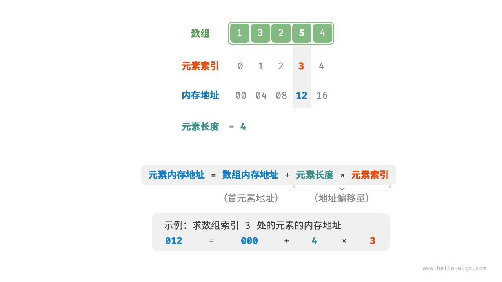
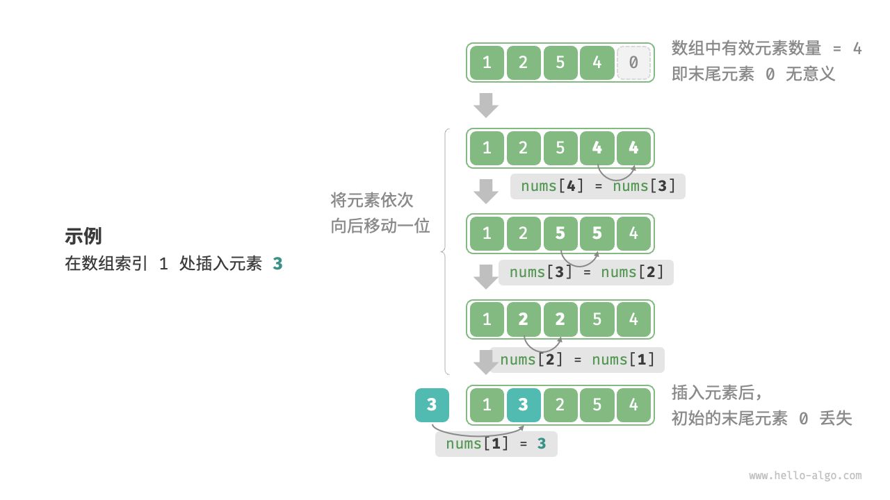

# 数组

「数组 array」是一种线性数据结构，其将相同类型的元素存储在连续的内存空间中。我们将元素在数组中的位置称为该元素的「索引 index」。


## 初始化数组

```js
/* 初始化数组 */
var arr = new Array(5).fill(0);
var nums = [1, 3, 2, 5, 4];
```

## 访问元素

数组元素被存储在连续的内存空间中，这意味着计算数组元素的内存地址非常容易。给定数组内存地址`首元素内存地址`和`某个元素的索引`，我们可以使用公式计算得到该元素的内存地址，从而直接访问该元素。



我们发现数组首个元素的索引为0，这似乎有些反直觉，因为从1开始计数会更自然。但从地址计算公式的角度看，`索引本质上是内存地址的偏移量`。首个元素的地址偏移量是0，因此它的索引为0是合理的。

```js
/* 随机访问元素 */
function randomAccess(nums) {
    // 在区间 [0, nums.length) 中随机抽取一个数字
    const random_index = Math.floor(Math.random() * nums.length);
    // 获取并返回随机元素
    const random_num = nums[random_index];
    return random_num;
}
```

## 插入元素

数组元素在内存中是“紧挨着的”，它们之间没有空间再存放任何数据。如果想在数组中间插入一个元素，则需要将该元素之后的所有元素都向后移动一位，之后再把元素赋值给该索引。



值得注意的是，由于数组的长度是固定的，因此插入一个元素必定会导致数组尾部元素“丢失”。我们将这个问题的解决方案留在“列表”章节中讨论

```js
/* 在数组的索引 index 处插入元素 num */
function insert(nums, num, index) {
    // 把索引 index 以及之后的所有元素向后移动一位
    for (let i = nums.length - 1; i > index; i--) {
        nums[i] = nums[i - 1];
    }
    // 将 num 赋给 index 处的元素
    nums[index] = num;
}
```

## 删除元素

若想删除索引i处的元素，则需要把索引i之后的元素都向前移动一位。


请注意，删除元素完成后，原先末尾的元素变得“无意义”了，所以我们无须特意去修改它。

```js
/* 删除索引 index 处的元素 */
function remove(nums, index) {
    // 把索引 index 之后的所有元素向前移动一位
    for (let i = index; i < nums.length - 1; i++) {
        nums[i] = nums[i + 1];
    }
}
```

总的来看，数组的插入与删除操作有以下缺点
- 时间复杂度高
- 丢失元素
- 内存浪费

## 扩容数组

在复杂的系统环境中，程序难以保证数组之后的内存空间是可用的，从而无法安全地扩展数组容量。因此在大多数编程语言中，数组的长度是不可变的

如果我们希望扩容数组，则需重新建立一个更大的数组，然后把原数组元素依次复制到新数组。

```js
/* 扩展数组长度 */
// 请注意，JavaScript 的 Array 是动态数组，可以直接扩展
// 为了方便学习，本函数将 Array 看作长度不可变的数组
function extend(nums, enlarge) {
    // 初始化一个扩展长度后的数组
    const res = new Array(nums.length + enlarge).fill(0);
    // 将原数组中的所有元素复制到新数组
    for (let i = 0; i < nums.length; i++) {
        res[i] = nums[i];
    }
    // 返回扩展后的新数组
    return res;
}
```