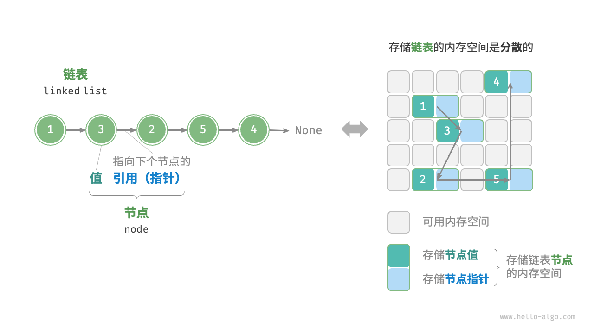
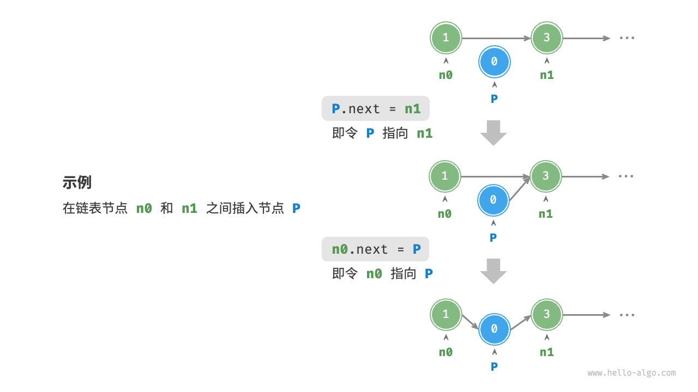
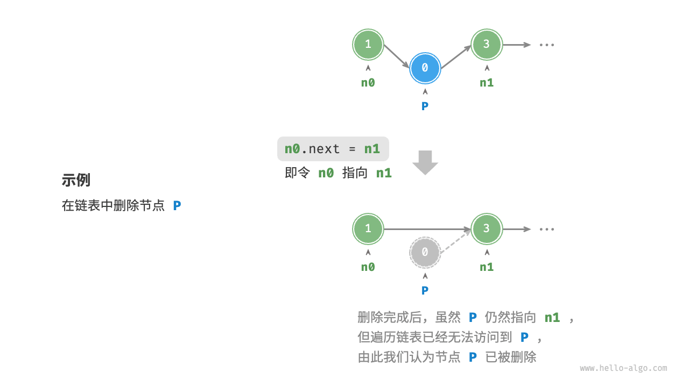

# 链表

内存空间是所有程序的公共资源，在一个复杂的系统运行环境下，空闲的内存空间可能散落在内存各处。我们知道，存储数组的内存空间必须是连续的，而当数组非常大时，内存可能无法提供如此大的连续空间。此时链表的灵活性优势就体现出来了。

「链表 linked list」是一种线性数据结构，其中的每个元素都是一个节点对象，各个节点通过“引用”相连接。引用记录了下一个节点的内存地址，通过它可以从当前节点访问到下一个节点。

链表的设计使得各个节点可以分散存储在内存各处，它们的内存地址无须连续。



```js
/* 链表节点类 */
class ListNode {
    constructor(val, next) {
        this.val = (val === undefined ? 0 : val);       // 节点值
        this.next = (next === undefined ? null : next); // 指向下一节点的引用
    }
}
```

```js
/* 初始化链表 1 -> 3 -> 2 -> 5 -> 4 */
// 初始化各个节点
const n0 = new ListNode(1);
const n1 = new ListNode(3);
const n2 = new ListNode(2);
const n3 = new ListNode(5);
const n4 = new ListNode(4);
// 构建节点之间的引用
n0.next = n1;
n1.next = n2;
n2.next = n3;
n3.next = n4;
```

## 插入节点

在链表中插入节点非常容易。假设我们想在相邻的两个节点 n0 和 n1 之间插入一个新节点 P ，则只需改变两个节点引用（指针）即可



```js
function insert(n0, P) {
    const n1 = n0.next;
    P.next = n1;
    n0.next = P;
}
```

## 删除节点

在链表中删除节点也非常方便，只需改变一个节点的引用（指针）即可。



```js
/* 删除链表的节点 n0 之后的首个节点 */
function remove(n0) {
    if (!n0.next) return;
    // n0 -> P -> n1
    const P = n0.next;
    const n1 = P.next;
    n0.next = n1;
}
```

## 访问节点

`在链表中访问节点的效率较低。`程序需要从头节点出发，逐个向后遍历，直至找到目标节点。

```js
/* 访问链表中索引为 index 的节点 */
function access(head, index) {
    for (let i = 0; i < index; i++) {
        if (!head) {
            return null;
        }
        head = head.next;
    }
    return head;
}
```

## 数组 vs. 链表

|          | 数组                           | 链表           |
| -------- | ------------------------------ | -------------- |
| 存储方式 | 连续内存空间                   | 分散内存空间   |
| 容量扩展 | 长度不可变                     | 可灵活扩展     |
| 内存效率 | 元素占用内存少、但可能浪费空间 | 元素占用内存多 |
| 访问元素 | O(1)                           | O(n)           |
| 添加元素 | O(n)                           | O(1)           |
| 删除元素 | O(n)                           | O(1)           |