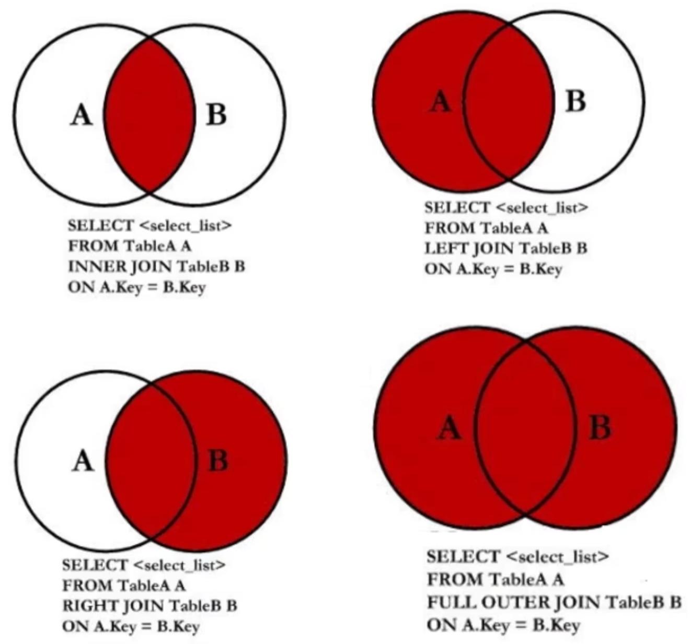

# 图解



## 交叉连接查询

:::tip 注意
交叉连接会产生笛卡尔乘积
:::

```sql
-- 语法
select * from A,B;
```

## 内连接查询

```sql
select * from A,B where 条件

select * from A inner join B on 条件 
```

## 外连接查询

```sql
-- 左外连接
select * from A left outer join B on 条件

-- 右外连接
select * from B left outer join A on 条件

-- 满外连接
select * from A full outer join B on 条件
```

## 子查询

```
select的嵌套
```

## 表自关联

```
将一张表当成多张表来用
```